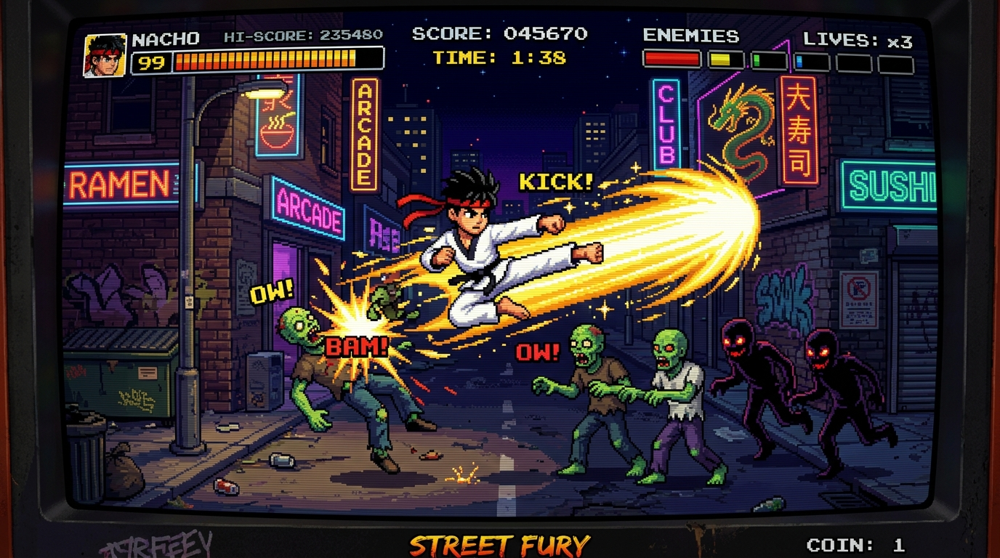

# 🥋 Nacho el Maestro - 2D Retro Beat 'em Up



**"Nacho el Maestro"** es un videojuego beat 'em up lineal en 2D que combina la jugabilidad y la precisión mecánica del clásico *Kung-Fu* de NES con el arte marcial del **Taekwondo** y una ambientación de fantasía y apocalipsis zombi en la era de los 16 bits.

---

## 🎮 Características Principales

- **Motor Gráfico con Pixi.js (v7):** Renderizado pixel-perfect a 60 FPS con estética arcade de 16 bits (`image-rendering: pixelated`) y filtro CRT con scanlines opcional.
- **Motor de Audio con Tone.js (v14):** Sintetizadores FM, percusión chiptune y efectos de sonido procedurales para patadas, impactos, alarmas de jefes y el grito de ki *"KIHAP!"*.
- **Sistema de Progresión de Cinturones:**
  - ⚪ **Nivel 1:** Cinturón Blanco (10º Kup - Principiante)
  - 🟡 **Nivel 2:** Cinturón Amarillo (8º Kup)
  - 🟢 **Nivel 3:** Cinturón Verde (6º Kup)
  - 🔵 **Nivel 4:** Cinturón Azul (4º Kup)
  - 🔴 **Nivel 5:** Cinturón Rojo (2º Kup)
  - ⚫ **Jefe Final / Victoria:** Cinturón Negro (1er Dan - Gran Maestro). Al derrotar al jefe supremo, Nacho se corona Gran Maestro con pantalla de victoria y créditos.
- **Técnicas Reales de Taekwondo (FSM):**
  - Patada circular de pie (*Dollyo Chagi*) o puñetazo directo.
  - Barrida baja rasante (*Ap Chagi*) para criaturas al ras del suelo.
  - Patada voladora en salto (*Twichagi*) con alcance frontal extendido para enemigos aéreos.
  - Ataque Especial *"Kihap Sagrado / Tornado Taekwondo"* (onda de choque radial masiva con enfriamiento estricto de 10 segundos).
- **Mecánicas de Enemigos (Estilo Kung-Fu NES):**
  - *Zombis Básicos:* Se abalanzan y se aferran a Nacho drenando su salud hasta ser eliminados o sacudidos.
  - *Zombis Rastreros:* Se arrastran por el suelo; exigen agacharse y conectar barrida baja.
  - *Espectros Voladores:* Requieren patada en salto en el aire.
  - *Chamanes Oscuros:* Lanzan proyectiles a dos alturas (alto: agacharse; bajo: saltar).
  - *5 Jefes de Escenario con barra de vida propia:* El Carnicero Mutante, Kukulkán Corrupto, Yeti Ancestral, Señor de la Ceniza y Lord Ryoko.
- **Soporte Móvil con Nipple.js:**
  - Detección automática: si se abre desde un teléfono móvil, se activa un joystick táctil dinámico con Nipple.js y botones virtuales de acción.

---

## 🕹️ Controles

### Teclado (PC / Laptop)
| Acción | Tecla |
| :--- | :--- |
| **Moverse a la Izquierda / Derecha** | `⬅️` / `➡️` Flechas |
| **Saltar** | `⬆️` Flecha Arriba |
| **Agacharse (Crouch)** | `⬇️` Flecha Abajo |
| **Patada de pie (Dollyo Chagi)** | `Barra Espaciadora` |
| **Barrida baja (Ap Chagi)** | `⬇️` + `Espacio` |
| **Patada voladora (Twichagi)** | `⬆️` + `Espacio` |
| **Ataque Especial (Kihap Tornado)** | `Tecla CTRL` (Cooldown 10s) |
| **Zafarse de zombis agarrados** | Presionar repetidamente `Flechas` o `Espacio` |
| **Filtro CRT (Scanlines)** | Botón en menú de inicio |

### Dispositivos Móviles
- **Joystick Virtual (Izquierda):** Movimiento horizontal, agacharse y salto.
- **Botón 🥋 (Derecha):** Patada o barrida según postura.
- **Botón ⚡ (Derecha):** Ataque Especial Kihap.

---

## 🚀 Cómo Ejecutar el Juego

El proyecto está diseñado como una aplicación web nativa (Zero-Build Vanilla HTML5/JS):

1. Clona el repositorio:
   ```bash
   git clone https://github.com/MarceloHarry08/Nacho.git
   ```
2. Abre directamente `index.html` en cualquier navegador moderno, o sírvelo con cualquier servidor HTTP local (por ejemplo con `server.ps1` en PowerShell o Live Server en VS Code).

---

## 📁 Estructura del Proyecto

```
Nacho/
├── index.html          # Interfaz principal, HUD arcade y modales
├── style.css           # Estilos retro, scanlines CRT y adaptabilidad móvil
├── server.ps1          # Servidor HTTP local ligero en PowerShell
├── assets/             # Arte visual, portadas y fondos
│   ├── cover.jpg
│   └── menu_bg.jpg
└── src/
    ├── config.js       # Configuraciones, niveles y paletas de cinturón
    ├── audio.js        # Motor de audio Tone.js y sintetizadores FM
    ├── pixelart.js     # Generador de spritesheets procedurales de 16 bits
    ├── particles.js    # Sistema de partículas y efectos visuales
    ├── backgrounds.js  # Fondos parallax multicapa continuos
    ├── entities.js     # Nacho (FSM), zombis, espectros, chamanes y jefes
    ├── levels.js       # Gestor de oleadas, jefes y progresión
    ├── ui.js           # Gestor de HUD y pantallas
    └── game.js         # Bucle a 60 FPS, colisiones AABB y Nipple.js
```

---

Desarrollado con pasión por el retro gaming y las artes marciales. 🥋
